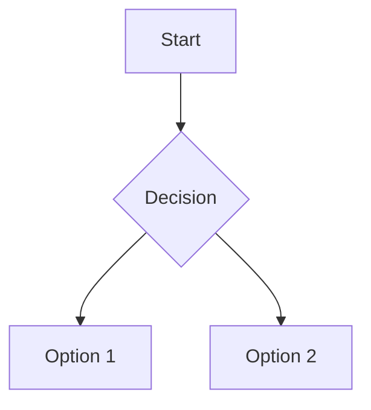

# My Project
This is **bold text** and this is *italic*.
## 📝 What is Markdown?

Markdown is a lightweight markup language that allows you to write using an easy-to-read, plain-text format, which then converts into structurally valid HTML (or other formats).

It’s widely used for:
- README files on GitHub
- Documentation
- Blog posts
- Wikis
- Chat messages (Discord, Slack, etc.)

Use `print("Hello")` in Python.
```python
def hello():
    print("Hello, world!")
```
> This is a blockquote.
>
> > Nested quote inside.
> ⚠️ **Warning**: Be careful!
>
> ℹ️ **Note**: This is useful information.
>
> 💡 **Tip**: Try this trick.
### Example:
| Name   | Age | City       |
|--------|-----|------------|
| Alice  | 30  | New York   |
| Bob    | 25  | London     |
| Carol  | 35  | Tokyo      |

---
***
___
😄 :smile:  
🚀 :rocket:  
🔥 :fire:  
👍 :+1:  
📚 :book:

Here is a sentence with a footnote.[^1]

[^1]: This is the footnote content.

<details>
<summary>Click to expand</summary>

This content was hidden.  
You can put logs, FAQs, or long explanations here.
</details>




<h3 align="center">Centered Heading</h3>

<div align="center">

This is inside a div.  
Can include buttons, videos, iframes.

</div>
```markdown
# My Project
This is **bold text** and this is *italic*.

# H1 Heading
## H2 Heading
### H3 Heading
#### H4 Heading
##### H5 Heading
###### H6 Heading

